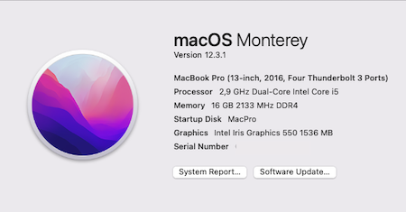

# Lenovo510S-14ISK-Hackintosh

# Monterey 12.3.1

## Specifications
Intel Core i5 6267u, Intel Iris 550 Graphics, 16 GB 2133 MHz DDR4 Memory, Plextor M8VC 512GB SSD

##  Screenshot




## BIOS Settings (Latest BIOS from Offical Lenovo)

```
Configuration Tab
  USB Legacy [Disabled]
  Wireless LAN [Enabled]
  Power Beep [Disabled]
  Intel Virtual Technology [Disabled]
  BIOS Back Flash [Disabled]
  HotKey Mode [Enabled]
  Always On USB [Enabled]
  
Security Boot
  Intel Platform Trust Technology [Disabled]

Boot
  Boot Mode [Legacy Support]
  Boot Priority [UEFI First]
  Fast Boot [Disabled]
  USB Boot [Enabled]
  PXE Boot to LAN [Disabled]
```
## Installation
Follow this guide: [LINK](https://dortania.github.io/OpenCore-Install-Guide/)

If you've got exactly same Laptop model, you can just simply use the EFI folder above.

## Working
1. Wi-Fi (Stock Intel card with itlwm kext)
2. Intel Iris 550 Graphics 
3. Sound
4. TouchPad with Multi-Gesture
5. Power Management & Battery Status
6. Brightness
7. Bluetooth

## Not Working
1. AirDrop


